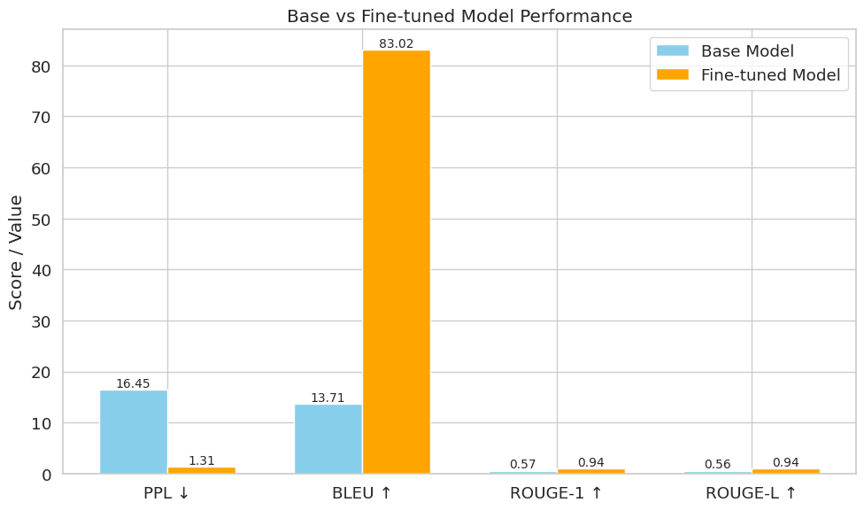
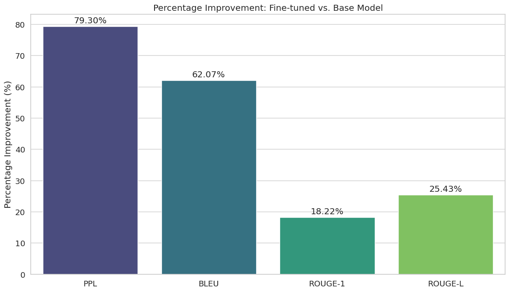
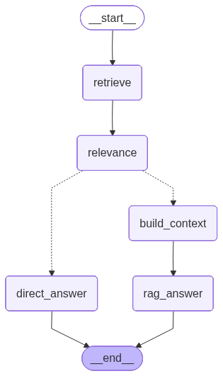

# FinAI — Financial Intelligence Assistant

A fine-tuned **Qwen 2.5 (1.5B)** model for financial question answering, served via a **FastAPI** backend with a **Hybrid RAG** pipeline powered by **Pinecone** and **LangGraph**.

---

## 📓 Training Notebook &nbsp;|&nbsp; 🎥 Demo

> GitHub does not render large Jupyter notebooks. The full fine-tuning notebook is hosted on Hugging Face for proper viewing.

**[View Training Notebook on Hugging Face →](https://huggingface.co/spaces/junaid17/FinAI/blob/main/Qwen2_5_financial_finetuning.ipynb)**

[](https://youtu.be/H0qx3JrcYv8)

---

## 🧠 Model Fine-Tuning

### Base Model
- **Qwen 2.5 — 1.5B parameters**

### Datasets Used
| Dataset | Description |
|---|---|
| [`sweatSmile/FinanceQA`](https://huggingface.co/datasets/sweatSmile/FinanceQA) | Financial QA dataset |

### Fine-Tuning Method — QLoRA with Unsloth
Used **LoRA (Low-Rank Adaptation)** via `unsloth`'s `FastLanguageModel` for memory-efficient fine-tuning:

```python
model = FastLanguageModel.get_peft_model(
    model,
    r=64,
    target_modules=["q_proj", "k_proj", "v_proj", "o_proj",
                    "gate_proj", "up_proj", "down_proj"],
    lora_alpha=64,
    lora_dropout=0.05,
    bias="none",
    use_gradient_checkpointing="unsloth",
    random_state=3407,
)
```

---

## 📊 Evaluation Results

Significant improvements across all metrics after fine-tuning:

```
────────────────────────────────────────────────────────────
Metric                 Base     Fine-tuned         Result
────────────────────────────────────────────────────────────
PPL ↓               16.4500         1.3100     ✓ improved
BLEU ↑              13.7119        83.0197     ✓ improved
ROUGE-1 ↑            0.5695         0.9406     ✓ improved
ROUGE-L ↑            0.5572         0.9385     ✓ improved
```

### Metric Plots



### Improvements Overview



---

## 🏗️ System Architecture

### LangGraph Workflow

The backend uses **LangGraph** to orchestrate a stateful RAG pipeline with conditional routing:



**Flow:**
1. `retrieve` — Hybrid retrieval (Dense + BM25) from Pinecone
2. `relevance` — Checks if retrieved docs are meaningful (>50 chars)
3. **Conditional Route:**
   - If relevant docs found → `build_context` → `rag_prompt` → LLM
   - If no relevant docs → `direct_prompt` → LLM

---

## 🔌 FastAPI Backend

### Endpoints

| Method | Endpoint | Description |
|---|---|---|
| `GET` | `/` | Health check |
| `POST` | `/upload` | Upload a PDF document for RAG |
| `DELETE` | `/reset` | Delete all documents from the vector store |
| `POST` | `/chat/stream` | Streaming chat with SSE (Server-Sent Events) |

### `/chat/stream` — Streaming Response Format

The chat endpoint streams responses using **Server-Sent Events (SSE)**. Three event types are emitted:

```
data: {"type": "metadata", "used_rag": true, "sources": [...], "confidence": 0.9312, "thread_id": "..."}

data: {"type": "token", "content": "..."}

data: {"type": "done"}
```

**`confidence`** — A sigmoid-normalized score (0.0–1.0) from the cross-encoder reranker reflecting how relevant the top retrieved document is to the query. `0.0` when RAG is not used (direct LLM fallback).

### `/upload` — Document Ingestion Flow

```
PDF Upload → Delete old docs → Load → Split (1000 chars, 250 overlap)
          → Embed & store in Pinecone → Build BM25 index
```

---

## 🔍 RAG Pipeline

### Embedding Model — `BAAI/bge-base-en-v1.5`

Chosen for its excellent balance of **speed and retrieval quality**:
- Ranked highly on the [MTEB Leaderboard](https://huggingface.co/spaces/mteb/leaderboard) for retrieval tasks
- 768-dimensional embeddings — compact yet highly expressive
- Significantly faster inference than larger models (e.g., `bge-large`) with minimal quality trade-off
- Optimized for semantic similarity, making it ideal for financial document retrieval

### Vector Database — Pinecone

- **Serverless** index on AWS `us-east-1`
- Cosine similarity metric
- 768-dimensional vectors matching the embedding model

### Hybrid Retriever — Dense + BM25

Combines two complementary retrieval strategies:

| Retriever | Type | Strength |
|---|---|---|
| **Dense** (Pinecone) | Semantic / vector search | Understands meaning and context |
| **BM25** | Keyword / lexical search | Exact term matching, financial jargon |

Results are merged and deduplicated, giving the best of both worlds — semantic understanding and precise keyword matching critical for financial terminology.

### Cross-Encoder Re-ranker — `cross-encoder/ms-marco-MiniLM-L-6-v2`

After hybrid retrieval, all candidate documents are re-scored using a **Cross-Encoder** model before being passed to the LLM.

**Why Cross-Encoder over Bi-Encoder for re-ranking?**
Bi-encoders (like the embedding model) encode query and document independently — fast but less accurate. A cross-encoder processes the query and document **together**, enabling full attention across both, which produces much more accurate relevance scores.

**Model chosen: `cross-encoder/ms-marco-MiniLM-L-6-v2`**

| Property | Detail |
|---|---|
| Size | ~85 MB |
| Architecture | MiniLM-L6 (6-layer transformer) |
| Trained on | MS MARCO passage ranking dataset |
| Strength | High accuracy relevance scoring at very low latency |
| Why this model | Best accuracy-to-size ratio among MS MARCO cross-encoders; well under 1 GB; production-proven |

**Pipeline after retrieval:**
```
Hybrid Docs (Dense + BM25, deduplicated)
  → Cross-Encoder scores each (query, doc) pair
  → Sort by score descending
  → Keep top 6 docs
  → Sigmoid-normalize top score → confidence (0.0–1.0)
  → Pass to LLM context
```

### Confidence Score

The reranker's top relevance score is sigmoid-normalized to a **0.0–1.0 confidence value** and returned in every `/chat/stream` metadata event. This lets the frontend indicate how strongly the retrieved context supports the answer.

---

## 🚀 Getting Started

### Prerequisites
- Python 3.10+
- Pinecone account
- `llama-cpp-python` installed (with appropriate backend for your hardware)

### Installation

```bash
git clone https://github.com/YOUR_USERNAME/YOUR_REPO.git
cd YOUR_REPO
pip install -r requirements.txt
```

### Environment Variables

Create a `.env` file:

```env
PINECONE_API_KEY=<your_pinecone_api_key>
```

### Run the Server

```bash
uvicorn app:app --reload
```

API will be live at `http://localhost:8000`

---

## 🗂️ Project Structure

```
FINAL-CODER/
├── assets/
│   ├── workflow.png        # LangGraph workflow diagram
│   ├── metrices.png        # Metric comparison plots
│   └── improvements.png    # Before/after improvement chart
├── scripts/
│   ├── load_llm.py         # Model loader (ChatLlamaCpp singleton)
│   ├── main.py             # LangGraph graph + streaming logic
│   └── rag.py              # RAG pipeline (Pinecone + BM25)
├── Notebook/
│   └── Qwen2_5_financial_finetuning.ipynb
├── app.py                  # FastAPI application
├── requirements.txt
└── .env
```

---

## 🤗 Model on Hugging Face

The fine-tuned GGUF model is hosted on Hugging Face:

**[junaid17/qwen2.5-finance-assistant-gguf](https://huggingface.co/junaid17/qwen2.5-finance-assistant-gguf)**

---

## 🛠️ Tech Stack

| Component | Technology |
|---|---|
| LLM | Qwen 2.5 1.5B (QLoRA fine-tuned, GGUF) |
| Inference | `llama-cpp-python` via `ChatLlamaCpp` |
| Fine-tuning | Unsloth + QLoRA |
| Orchestration | LangGraph |
| Vector DB | Pinecone (Serverless) |
| Embeddings | `BAAI/bge-base-en-v1.5` |
| Sparse Retrieval | BM25 (`rank-bm25`) |
| Re-ranking | Cross-Encoder (`ms-marco-MiniLM-L-6-v2`) |
| Backend | FastAPI + Uvicorn |
| Memory | LangGraph `MemorySaver` (per thread_id) |
